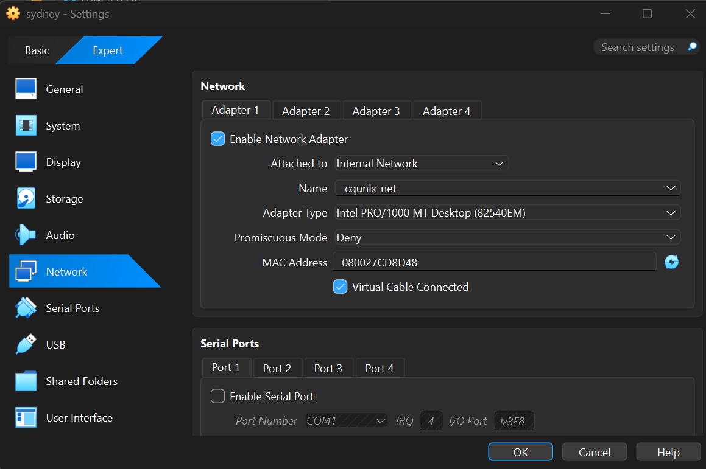
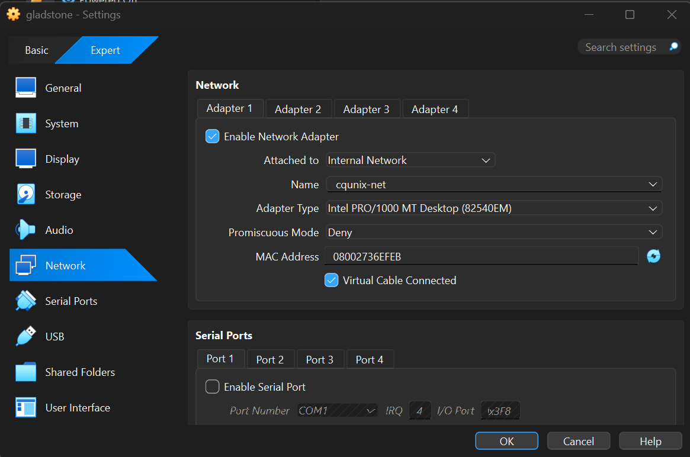
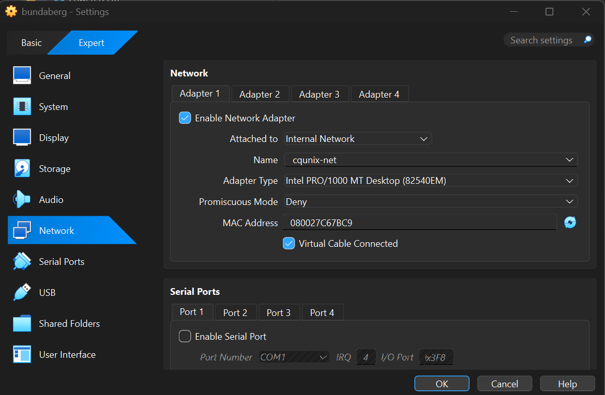
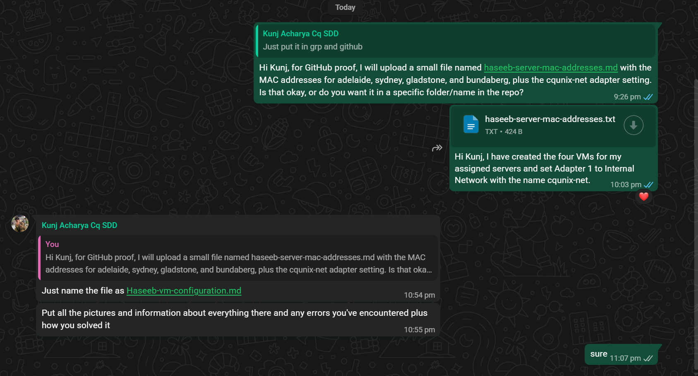

# Haseeb VM Configuration

## Purpose

This file records the VirtualBox VM configuration for my assigned servers in the cqunix system and network administration project.

## Assigned Servers

| Server | Role | DHCP Assigned IP | MAC Address |
|---|---|---|---|
| adelaide | Apache, DokuWiki, HTTPS and certificates | 172.16.1.10 | 08002773F45B |
| sydney | SSH server and login auditing | 172.16.1.11 | 080027CD8D48 |
| gladstone | Internal Git server | 172.16.1.12 | 08002736EFEB |
| bundaberg | Backup server/scripts | 172.16.1.13 | 080027C67BC9 |

## Network Configuration

Each VM was created in Oracle VirtualBox using a cloned Ubuntu Server VM.

For all four VMs, Adapter 1 was configured as:

| Setting | Value |
|---|---|
| Adapter | Adapter 1 |
| Attached to | Internal Network |
| Internal Network Name | cqunix-net |
| Static IP configured manually | No |

The static IP addresses are not manually configured inside the VMs. The fixed IP addresses will be assigned by the darwin DHCP server using each VM MAC address.

## VM List

The following VMs were created:

- adelaide
- sydney
- gladstone
- bundaberg

## Screenshots / Evidence

### Adelaide network adapter configuration

### Sydney network adapter configuration

### Gladstone network adapter configuration

### Bundaberg network adapter configuration

### Group chat communication proof

## Issues Encountered and Solutions

### Issue 1: GitHub file name clarification

At first, I was unsure what file name should be used for GitHub proof. I asked Kunj for clarification. He confirmed that the file should be named:

`Haseeb-vm-configuration.md`

### Issue 2: Understanding DHCP assigned IP addresses

I was unsure whether I needed to manually configure the IP addresses inside the VMs. After checking the group instruction, I understood that the IP addresses will be assigned by the darwin DHCP server based on the MAC addresses. Therefore, I did not configure static IPs manually.

### Issue 3: Avoiding wrong network configuration

I made sure each VM used the same internal network name:

`cqunix-net`

This is important because the VMs must be connected to the same internal network for DHCP and server communication.

## Current Status

The four assigned VMs have been created, their Adapter 1 settings have been changed to Internal Network `cqunix-net`, and their MAC addresses have been recorded and shared with the group leader for DHCP configuration.
